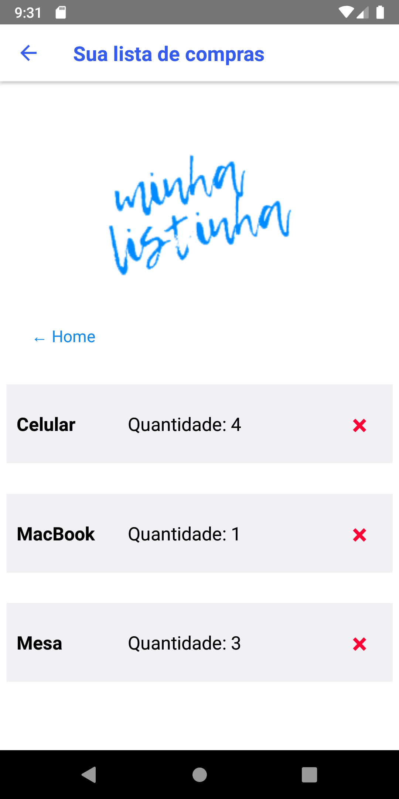

# Listinha -React Native and Axios list mobile application

Listinha is a to buy list mobile application based in React Native. It uses Axios to handle the HTTP request to a generic backend.

It was created as a studying project of these technologies.

To make it work you need to use a backend application with the correct routes. You can take the one I used <a href="https://github.com/conradoalexsander/software-residency/tree/master/M%C3%B3dulo%20Avan%C3%A7ado/dotNET/Trabalho%20Final" alt="generic backend for testing purposes">here </a>

OBS 1.: Remember to apply the connection url of your backend server in src/config/apiConfig.json, otherwise Axios won't have the correct server to make its requests

OBS 2.: If you are running into connections problems in your local server, there is a high chance that this is a network port problem, in this case, you could try to expose the port of your local server using <a href="https://ngrok.com/">ngrok </a>, if you are runing an ISS Express server in Visual Studio, <a href="https://marketplace.visualstudio.com/items?itemName=DavidProthero.NgrokExtensions">this </a> extension can do the trick!

OBS 3.: App currently is bugged, if you delete an item it won't appear in the screen until you reload the page!

Some screens of the Listinha app:

 

 
 

Listinha é um aplicativo móvel de lista de compra baseado no React Native. Ele usa o Axios para manipular a solicitação HTTP para um back-end genérico.

Foi criado como um projeto de estudo dessas tecnologias.

Para fazê-lo funcionar, você precisa usar um aplicativo de back-end com as rotas corretas. Você pode usar o que eu usei <a href = "https://github.com/conradoalexsander/software-residency/tree/master/M%C3%B3dulo%20Avan%C3%A7ado/dotNET/Trabalho%20Final" alt = "back-end genérico para fins de teste"> aqui </a>

OBS 1 .: Lembre-se de aplicar o URL de conexão do servidor back-end em src / config / apiConfig.json, caso contrário o Axios não terá o servidor correto para fazer suas solicitações.

OBS 2 .: Se você estiver enfrentando problemas de conexão no servidor local, há uma grande chance de que seja um problema de porta de rede; nesse caso, você pode tentar expor a porta do servidor local usando <a href = " https://ngrok.com/">ngrok </a>, se você estiver executando um servidor ISS Express no Visual Studio, <a href = "https://marketplace.visualstudio.com/items?itemName=DavidProthero.NgrokExtensions "> esta extensão </a> pode fazer o truque!

OBS 3 .: O aplicativo está com problemas no momento, se você excluir um item, ele não aparecerá na tela até que você recarregue a página!

